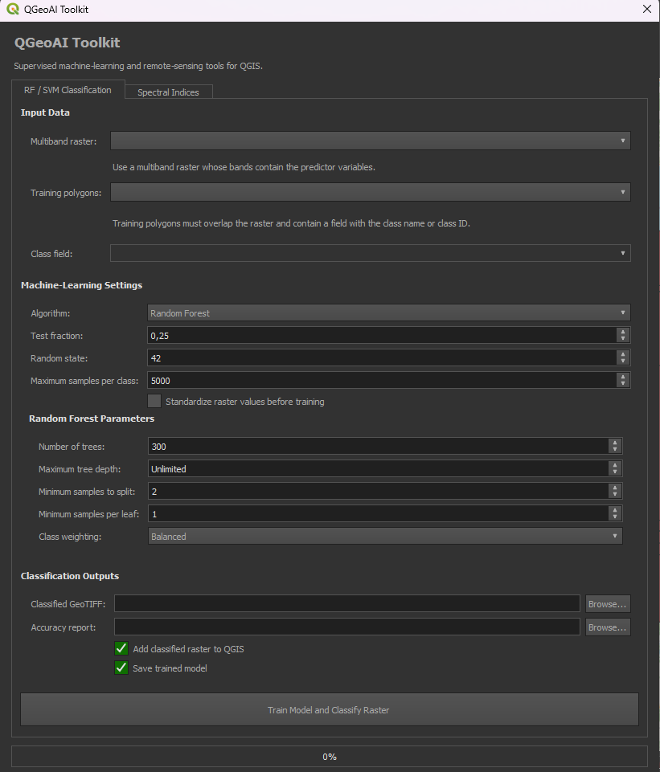
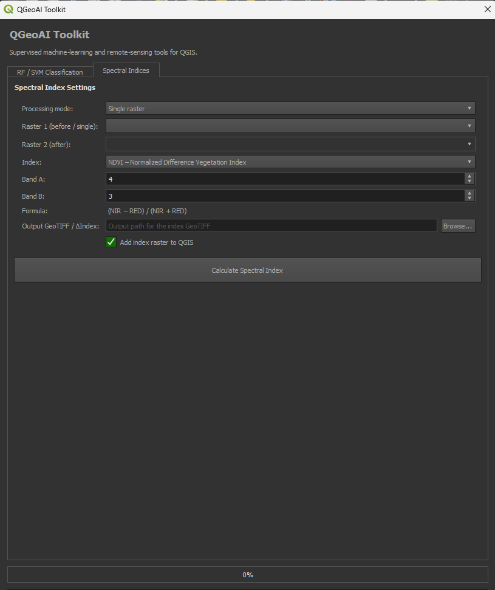

# QGeoAI Toolkit

### AI-Powered Remote Sensing & Machine Learning Plugin for QGIS


**Open-source QGIS plugin for GeoAI, Remote Sensing, Earth Observation and Machine Learning.**

---

Developed by **Dimitra Pappa**

</div>

---

# Overview

QGeoAI Toolkit is an open-source QGIS plugin that integrates Artificial Intelligence, Remote Sensing and Machine Learning directly into QGIS.

The plugin enables users to calculate spectral indices, perform supervised image classification and analyze multispectral satellite imagery using modern GeoAI techniques.

Designed for researchers, GIS professionals and students working with Earth Observation data.

---

# Features

## Spectral Indices

| Index | Description |
|--------|-------------|
| NDVI | Normalized Difference Vegetation Index |
| GNDVI | Green Normalized Difference Vegetation Index |
| NDWI | Normalized Difference Water Index |
| SAVI | Soil Adjusted Vegetation Index |
| NDMI | Normalized Difference Moisture Index |
| NBR | Normalized Burn Ratio |

---

## Machine Learning

✔ Random Forest Classification

✔ Support Vector Machine (SVM)

✔ Training Polygon Support

✔ Classification Report

✔ Accuracy Assessment

✔ GeoTIFF Export

---

# Supported Satellite Data

| Dataset | Supported |
|----------|-----------|
| Sentinel-2 | ✅ |
| Landsat | ✅ |
| GeoTIFF | ✅ |
| Virtual Raster (VRT) | ✅ |
| Multiband Raster | ✅ |

---

# Workflow

```text
Satellite Image
        │
        ▼
Load Multiband Raster
        │
        ▼
Calculate Spectral Index
        │
        ▼
Create Training Areas
        │
        ▼
Train Random Forest / SVM
        │
        ▼
Generate Classified Raster
        │
        ▼
Export GeoTIFF
```

---

# Installation

Clone the repository

```bash
git clone https://github.com/demetrapappa14-geospatial/QGeoAI-Toolkit.git
```

Open your QGIS Plugins folder and copy the plugin directory.

Enable the plugin from:

```
Plugins → Manage and Install Plugins
```

---

# Spectral Indices

| Index | Formula | Sentinel-2 Bands |
|--------|---------|------------------|
| NDVI | (NIR - Red)/(NIR + Red) | B08 / B04 |
| GNDVI | (NIR - Green)/(NIR + Green) | B08 / B03 |
| NDWI | (Green - NIR)/(Green + NIR) | B03 / B08 |
| SAVI | Soil Adjusted Vegetation Index | B08 / B04 |
| NDMI | (NIR - SWIR1)/(NIR + SWIR1) | B08 / B11 |
| NBR | (NIR - SWIR2)/(NIR + SWIR2) | B08 / B12 |

---

# Machine Learning

The plugin currently supports:

| Algorithm | Status |
|------------|--------|
| Random Forest | ✅ |
| Support Vector Machine | ✅ |

Future versions will include additional GeoAI methods.

---

# Screenshots

## Main Interface

The QGeoAI Toolkit provides a user-friendly interface for spectral index computation and AI-based image classification directly within QGIS.

<table>
<tr>

<td align="center">

<b>Machine Learning Module</b><br><br>



</td>

<td align="center">

<b>Spectral Indices Module</b><br><br>



</td>

</tr>
</table>

------

## Spectral Indices

> *(NDVI, NDWI, SAVI examples)*

---

## Random Forest Classification

> *(Classification screenshot)*

---

# Project Structure

```text
QGeoAI-Toolkit
│
├── __init__.py
├── metadata.txt
├── qgeoai_plugin.py
├── qgeoai_dialog.py
├── ml_engine.py
├── raster_utils.py
├── indices.py
├── icon.png
├── README.md
└── LICENSE
```

---

# Requirements

| Software | Version |
|-----------|---------|
| QGIS | 3.38 or newer |
| Python | 3.10+ |
| NumPy | Latest |
| Rasterio | Latest |
| Scikit-Learn | Latest |
| Joblib | Latest |

---

# Roadmap

- Deep Learning Classification
- Object Detection
- Change Detection
- SAR Processing
- Explainable AI (XAI)
- Automatic Feature Selection
- GPU Acceleration
- Batch Processing

---

# Contributing

Contributions are welcome!

Feel free to:

- Report issues
- Suggest new features
- Submit pull requests
- Improve documentation

---

# Citation

If you use QGeoAI Toolkit in your research, please cite this repository.

---


# License

This project is distributed under the **MIT License**.

---

# Author

**Dimitra Pappa**

Surveying Engineer & Geoinformatics

MSc Artificial Intelligence & Visual Computing

GeoAI • Remote Sensing • GIS • Earth Observation

GitHub:

https://github.com/demetrapappa14-geospatial

--

<div align="center">

⭐ If you find this project useful, consider giving it a star!

</div>
